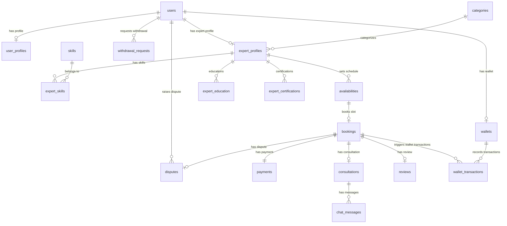

# Dokumentasi Sistem Aplikasi Web Konsultasi (E-Konsul)

Dokumen ini menjelaskan rancangan sistem, skema database beserta relasinya, alur kerja sistem (workflows), fitur-fitur, dan aturan bisnis yang diterapkan pada aplikasi **E-Konsul**.

---

## 1. Arsitektur Database & Relasi Tabel

Aplikasi E-Konsul menggunakan database relasional (MySQL) dengan skema berikut:

### Diagram Relasi Tabel (ERD)



### Penjelasan Detail Tabel

#### A. Tabel Core & Akun
1. **`users`**: Menyimpan kredensial dasar pengguna.
   * `role`: `client`, `expert`, atau `admin`.
   * `status`: `active` atau `suspended` (penangguhan akun jika melanggar aturan).
2. **`user_profiles`**: Menyimpan profil biodata tambahan pengguna (nama, nomor telepon, gender, avatar).
3. **`expert_profiles`**: Informasi spesifik untuk akun pakar/expert.
   * `verification_status`: `pending`, `approved`, atau `rejected`.
   * `hourly_rate`: Tarif per jam konsultasi.
   * `is_online`: Status online pakar untuk konsultasi instan.
   * `average_rating`: Rating rata-rata yang otomatis dihitung dari review.
   * `commission_level`: Level pembagian komisi (`newbie`, `pro`, `master`).
   * `penalty_count`: Jumlah pelanggaran (misalnya tidak menghadiri sesi).

#### B. Tabel Keahlian & Portofolio
4. **`categories`**: Kategori utama spesialisasi pakar (misal: IT & Software).
5. **`skills`**: Nama keahlian spesifik (misal: Laravel, React).
6. **`expert_skills`**: Tabel pivot untuk relasi *Many-to-Many* antara pakar dan keahlian mereka.
7. **`expert_education`**: Riwayat sekolah/pendidikan resmi pakar.
8. **`expert_certifications`**: Daftar sertifikasi kompetensi pakar.

#### C. Tabel Jadwal & Sesi
9. **`availabilities`**: Slot waktu yang disediakan pakar untuk dipesan oleh klien.
   * `status`: `available`, `locked` (sedang dalam proses checkout pembayaran), atau `booked`.
   * `locked_by`: Menyimpan ID klien yang sedang mengunci slot waktu ini.
10. **`bookings`**: Transaksi pemesanan sesi konsultasi.
    * `booking_type`: `scheduled` (berdasarkan slot availability) atau `instant` (langsung tanpa slot jika pakar online).
    * `status`: `pending_payment`, `confirmed`, `ongoing`, `pending_settlement`, `completed`, `cancelled`, `disputed`.
    * `client_joined` & `expert_joined`: Flag kehadiran masing-masing pengguna di ruang chat.
11. **`consultations`**: Sesi konsultasi aktif yang menghubungkan ke ruang obrolan.
12. **`chat_messages`**: Riwayat pesan di dalam sesi konsultasi.

#### D. Tabel Keuangan & Reputasi
13. **`payments`**: Transaksi pembayaran booking.
    * `platform_commission`: Potongan komisi platform.
    * `expert_earnings`: Pendapatan bersih untuk pakar.
    * `status`: `unpaid`, `paid`, `refunded`.
14. **`wallets`**: Menyimpan saldo e-wallet pengguna (klien maupun pakar).
15. **`wallet_transactions`**: Riwayat mutasi saldo (`credit` masuk, `debit` keluar).
16. **`withdrawal_requests`**: Permintaan penarikan dana saldo e-wallet oleh pakar ke rekening bank mereka.
17. **`reviews`**: Ulasan dan rating dari klien untuk pakar setelah sesi selesai.
18. **`disputes`**: Komplain/sengketa yang diajukan jika salah satu pihak tidak puas dengan sesi konsultasi.
19. **`platform_settings`**: Konfigurasi global sistem (tarif fee, batas waktu pembatalan, durasi sesi).

---

## 2. Alur Sistem (Workflows)

### A. Alur Registrasi & Verifikasi Pakar
```
Pakar Mendaftar -> Mengisi Profil, Pendidikan & Sertifikat -> Status: Pending
                                                                   |
                                                                   v
                                                        Admin Review Dokumen
                                                                   |
                                         +-------------------------+-------------------------+
                                         |                                                   |
                                         v                                                   v
                                      Approve                                             Reject
                          (Status: Approved, bisa                               (Status: Rejected, pakar
                          atur slot & mulai konsultasi)                          bisa perbaiki profil)
```

### B. Alur Pemesanan Terjadwal (Scheduled Booking)
1. **Pencarian**: Klien melihat katalog pakar terverifikasi (`approved`) dan memilih slot jadwal (`availabilities`) yang aktif.
2. **Lock Slot**: Klien menekan tombol booking -> Sistem mengunci slot tersebut (`status = locked`) selama **15 menit** (`auto_cancel_minutes`) agar tidak dipesan orang lain.
3. **Pembayaran**: Klien membayar menggunakan saldo Wallet.
   * Saldo klien dipotong langsung (`debit`).
   * Status pembayaran berubah menjadi `paid` dan status booking menjadi `confirmed`.
   * Uang disimpan di escrow platform (belum dikirim ke Wallet pakar).
4. **Mulai Sesi**: Saat waktu slot tiba, sistem merubah status booking menjadi `ongoing` dan membuat record `consultations` baru.
5. **Konsultasi**: Klien dan pakar masuk ke halaman ruang chat (`booking.room`) untuk berdiskusi.
6. **Akhiri Sesi**: Sesi selesai ketika salah satu pihak mengklik tombol selesai, atau sistem menutup sesi otomatis setelah melewati jam selesai (`end_time`) untuk tipe terjadwal (scheduled) atau 1 jam (`session_duration_hours`) untuk tipe instan. Status berubah menjadi `pending_settlement`.
7. **Pencairan Dana (Settlement)**: Uang dicairkan ke Wallet pakar (`credit`) dikurangi komisi platform setelah **24 jam** secara otomatis (atau langsung jika dikonfirmasi klien) selama tidak ada dispute.

### C. Alur Pemesanan Instan (Instant Consultation)
1. Klien mencari pakar yang sedang mengaktifkan status **Online** (`is_online = true`).
2. Klien mengklik **"Konsultasi Sekarang"**.
3. Sistem membuat booking instan tanpa perlu slot jadwal. Klien melakukan pembayaran melalui Wallet.
4. Setelah bayar, status sesi langsung di-set menjadi `ongoing` dengan batas waktu kehadiran (**10 menit**).
5. **Aturan Kehadiran (No-Show Check)**:
   * Jika dalam 10 menit kedua pihak masuk chat, status sesi berjalan normal.
   * Jika **Klien tidak hadir** (Pakar hadir): Sesi batal, dana hangus (Pakar tetap dibayar penuh sebagai kompensasi).
   * Jika **Pakar tidak hadir** (Klien hadir): Sesi batal, dana di-refund penuh ke Wallet Klien, Pakar mendapat penalti (`penalty_count` bertambah).

### D. Alur Penarikan Saldo (Withdrawal)
1. Pakar mengajukan penarikan dana dari halaman e-wallet mereka ke rekening tujuan.
2. Saldo e-wallet pakar langsung dikurangi seketika sebesar nominal penarikan untuk menghindari pengeluaran ganda.
3. Admin meninjau permintaan penarikan:
   * **Setuju (Approve)**: Admin mengunggah bukti transfer bank. Status request menjadi `completed`.
   * **Tolak (Reject)**: Admin mengisi alasan penolakan. Saldo dikembalikan instan ke e-wallet pakar. Status request menjadi `rejected`.

---

## 3. Fitur Utama Berdasarkan Peran (Roles)

### 👥 Pengunjung Umum / Guest
* Melihat katalog pakar berdasarkan kategori.
* Melihat detail profil pakar (biografi, rating, riwayat pendidikan, sertifikat, dan ulasan klien).
* Melakukan registrasi akun atau login.

### 👤 Klien (Client)
* **Katalog & Profil**: Mencari pakar, filter keahlian, dan membaca ulasan.
* **Top-Up Saldo**: Mengisi saldo e-wallet dengan metode pembayaran simulasi (Gopay, Bank Transfer, dll).
* **Booking Sesi**: Memesan konsultasi terjadwal (memilih slot) atau konsultasi instan (langsung chat).
* **Ruang Chat**: Kirim pesan teks, gambar, atau berkas dalam ruang konsultasi.
* **Rating & Review**: Memberikan penilaian bintang (1-5) dan komentar setelah sesi berakhir.
* **Komplain (Dispute)**: Mengajukan komplain jika sesi bermasalah agar dana ditahan oleh admin.

### 👨‍💼 Pakar (Expert)
* **Pengaturan Profil**: Melengkapi biografi, portofolio pendidikan, sertifikasi kompetensi, keahlian, dan tarif per jam.
* **Manajemen Jadwal**: Mengatur slot hari dan jam ketersediaan mereka (`availabilities`).
* **Fitur Online/Offline**: Mengaktifkan tombol online agar bisa menerima sesi instan.
* **Dashboard Pendapatan**: Melihat saldo e-wallet, riwayat pendapatan, dan mengajukan penarikan dana (Withdrawal).
* **Ruang Chat**: Berkonsultasi dengan klien secara real-time dan mengakhiri sesi.

### 🔑 Administrator (Admin)
* **Verifikasi Pakar**: Menyetujui atau menolak pendaftaran akun pakar baru berdasarkan kelayakan berkas.
* **Manajemen Pengguna**: Memblokir sementara (`suspended`) akun klien atau pakar yang melanggar aturan.
* **Monitoring Keuangan**: Memantau seluruh invoice transaksi pembayaran konsultasi.
* **Persetujuan Penarikan Dana**: Memproses pengajuan transfer penarikan saldo e-wallet pakar.
* **Penyelesaian Sengketa (Dispute)**: Menjadi mediator sengketa konsultasi (menentukan apakah dana di-refund ke klien atau dicairkan ke pakar).
* **Pengaturan Sistem**: Menyesuaikan parameter biaya admin/komisi platform, batas waktu cancel, durasi default sesi melalui menu Platform Settings.

---

## 4. Aturan Bisnis Utama (Business Rules)

### 💰 Pembagian Pendapatan & Komisi Platform
* Biaya admin bawaan platform adalah **10%** dari tarif pakar (dapat diubah via menu Admin Settings).
* **Top Rated Badge**: Pakar yang memiliki rating rata-rata `>= 4.8` dan telah menyelesaikan `>= 10` sesi otomatis mendapatkan diskon fee admin sebesar **2%** (sehingga hanya dipotong 8%).
* **Leveling Komisi Pakar** (untuk analisis internal):
  * `newbie`: Sesi selesai `< 10` kali.
  * `pro`: Sesi selesai `>= 10` dan `< 50` kali.
  * `master`: Sesi selesai `>= 50` kali.

### 🛡️ Batas Waktu & Keamanan Transaksi
* **Booking Buffer Time**: Pakar tidak diperbolehkan memiliki jadwal sesi yang terlalu berdekatan. Sistem membatasi minimal jeda waktu **30 menit** sebelum atau sesudah sesi pakar yang telah terkonfirmasi.
* **Lead Time Booking**: Pemesanan sesi terjadwal minimal dilakukan **2 jam** sebelum sesi dimulai.
* **Locking Checkout**: Saat checkout booking, slot dikunci selama **15 menit**. Jika tidak dibayar dalam batas tersebut, slot otomatis dilepas kembali ke publik.

### 🔄 Pembatalan & Refund
* **Pembatalan > 2 Jam Sebelum Sesi**: Klien mendapatkan refund **100%** ke e-wallet mereka.
* **Pembatalan < 2 Jam Sebelum Sesi**: Klien hanya mendapatkan refund **80%**, sedangkan **20%** disalurkan ke pakar sebagai kompensasi waktu yang terbuang.
* **Pakar Melakukan Pembatalan**: Dana di-refund 100% ke klien, pakar mendapat penambahan `penalty_count`. Jika `penalty_count` mencapai **3 kali**, akun pakar otomatis disuspensi (`status = suspended`).

### ⏱️ Aturan Kehadiran Konsultasi Instan (No-Show Policy)
* Batas waktu toleransi keterlambatan masuk chat adalah **10 menit**.
* Jika klien tidak masuk chat hingga batas waktu habis sedangkan pakar sudah standby, status sesi dibatalkan dengan alasan `client_no_show`. Pembayaran klien hangus (100% dikirim ke pakar sebagai kompensasi).
* Jika pakar tidak masuk chat, sesi dibatalkan dengan status `expert_no_show`. Dana klien dikembalikan utuh (100%), dan pakar mendapat tambahan 1 penalti (`penalty_count`).

---

## 5. Task Scheduling & Cron Jobs

Sistem otomatisasi berbasis waktu di E-Konsul digerakkan oleh Laravel Task Scheduler yang dikonfigurasi pada file [console.php](file:///d:/laragon/www/projek/konsultasi-app/routes/console.php). 

Untuk menjalankan scheduler ini di server produksi, tim developer harus menambahkan entri Cron Job berikut pada server (cPanel/VPS):
```bash
* * * * * cd /path-to-project && php artisan schedule:run >> /dev/null 2>&1
```

Di lingkungan pengembangan (development), scheduler dapat disimulasikan menggunakan perintah:
```bash
php artisan schedule:work
```

### Daftar Perintah Scheduler (Artisan Commands)

Berikut adalah daftar task yang terdaftar dalam scheduler:

| Command Signature | Frekuensi | Deskripsi / Alur Bisnis yang Dijalankan | File Command |
| :--- | :--- | :--- | :--- |
| `slots:release-expired` | Setiap Menit (`everyMinute`) | Melepas slot `locked` yang telah melewati batas 15 menit tanpa pembayaran dan merubah status booking terkait menjadi `cancelled`. | [ReleaseExpiredSlots.php](file:///d:/laragon/www/projek/konsultasi-app/app/Console/Commands/ReleaseExpiredSlots.php) |
| `instant:check-attendance` | Setiap Menit (`everyMinute`) | Mengecek sesi instan yang melewati batas toleransi kehadiran 10 menit, memicu no-show refund (untuk klien) atau kompensasi (untuk pakar). | [CheckInstantConsultations.php](file:///d:/laragon/www/projek/konsultasi-app/app/Console/Commands/CheckInstantConsultations.php) |
| `payments:auto-approve` | Setiap Jam (`hourly`) | Menyelesaikan otomatis pembayaran (`settlePayment`) ke wallet pakar untuk sesi konsultasi yang telah berakhir selama 24 jam tanpa ajuan komplain (dispute). | [AutoApproveSettlements.php](file:///d:/laragon/www/projek/konsultasi-app/app/Console/Commands/AutoApproveSettlements.php) |

> [!NOTE]
> Pada konfigurasi `routes/console.php`, pastikan scheduler hanya memanggil perintah yang valid. Perintah `instant:check-attendance` adalah task resmi untuk penanganan *no-show* sesi instan.

